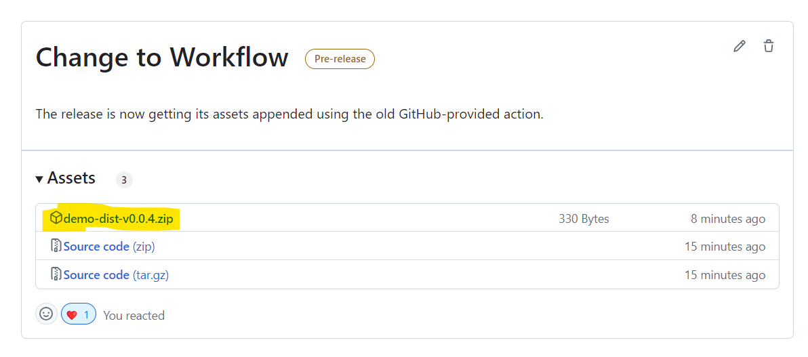

# Upload a Release Asset
A demo project of a GitHub Workflow that attaches release assets to a release.

Since [actions/upload-release-asset@v1](https://github.com/actions/upload-release-asset) has been archived and is stuck on node12 (now deprecated), I have created this demo to show how to do-it-yourself with the GitHub API from within your own workflow.

For an idea of how this is used, see [Versioning & Releasing](#Versioning--Releasing).

Please feel free to submit any improvements. 

## Versioning & Releasing

As releasing builds on versioning, first create a version, then release it if the version is okay.

### Versioned deployments

To deploy a new version of the demo (as if it was something useful), a tag should be created following [semantic versioning](https://semver.org/) rules and prefixed with "v". Eg, "v1.0.2-beta".

Once pushed, the distribution workflow will run (just a demo run).

For example, tag "v1.0.2-beta" could create resources such as documentation websites for the tag.

### Releases

| Note |
| ---- |
| Releasable versions should always be created from the main "trunk" branch. |

In this demo releases are created from the Github Release page. Then this demo will build and attach assets to the release.

To create a release, a version must first be tagged and pushed. Once pushed the tag can be selected from the new release page.

Next, enter a release title (typically the version number) and a description of the changes - this should include any breaking changes and migration information.

Once the release has been created release assets will be automatically built and attached to the release. 

Note: The  GITHUB_TOKEN must have read and write access to the repository for this to work.
